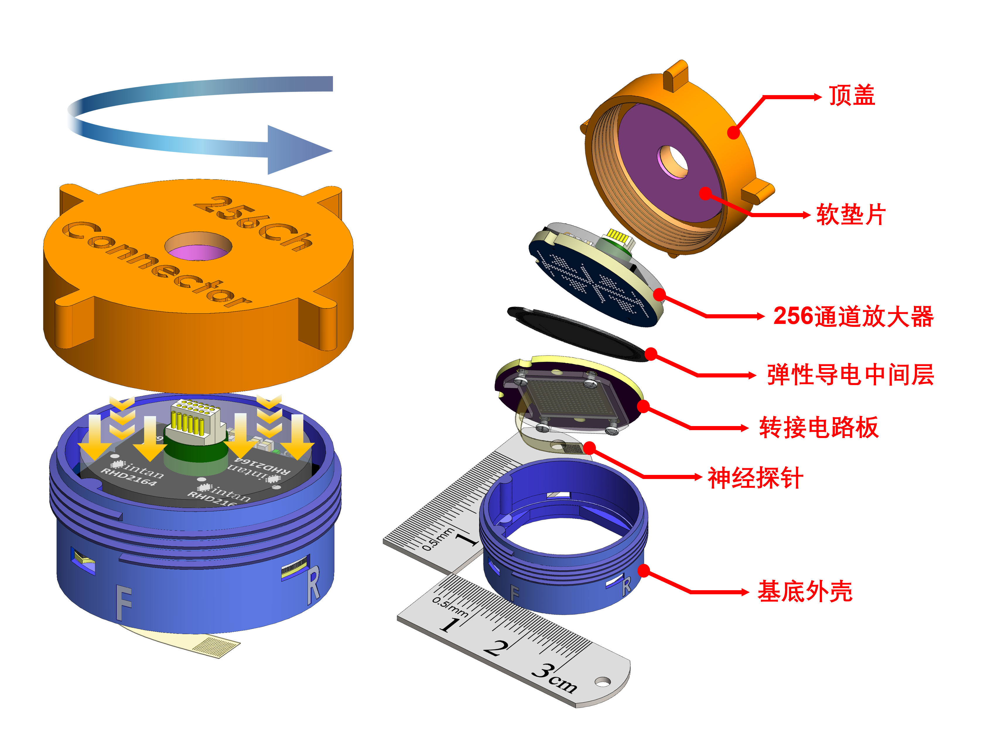

  

    <a href="https://tianyu-bai.github.io/E-Link">
      🌐 Click here to view the interactive website
    </a>
  

  
  
  
  
  
  

  

  <h1 style="border-bottom: none; margin-bottom: 5px; color: #60a5fa; font-size: 2em;">🚀 E-Link(256)</h1>
  

    

  

    
    
    
    
     
  

   
  

  
 
 

   <b>Mating Dynamics (left) and Structural Breakdown (right) of the E-Link(256) </b>
 

## 🔬 RHD Connector – Interactive 3D View

  
  <model-viewer
    src="{{ '/Videos/RHD_example.glb' | relative_url }}"
    alt="RHD Connector 3D Model"
    camera-controls
    auto-rotate
    interaction-prompt="none" 
    shadow-intensity="1"
    exposure="1.1"
    style="
      width: 100%;
      height: 460px;
      background: rgba(15,23,42,0.6);
      border-radius: 16px;
      border: 1px solid rgba(59,130,246,0.3);
      outline: none;
    ">
    
    

      

        
👆

      

      
Drag to Rotate

    

    

      

        
👇

        
☝️

      

      
Pinch to Zoom

    

  </model-viewer>
  

## 📖 Overview

**E-Link** (Elastomer Interconnection-based connector) is an open-source, miniature pedestal connector system based on elastomer interconnection. It provides a robust, scalable interface for flexible neural probes, specifically engineered for chronic applications in freely moving animals.

  
 

---

> [!NOTE]
> **Key Innovation:** The system integrates two high-density PCBs, an anisotropic elastomeric contact interface, and a lightweight pedestal housing into a fully integrated, headstage-ready solution.

---

### 📊 Quick Specifications

 <table style="margin-left: auto; margin-right: auto; width: 80%; text-align: center; border-collapse: collapse; border: 1px solid #e1e4e8;">
   <thead>
     <tr style="background-color: #f6f8fa; border-bottom: 2px solid #e1e4e8;">
       <th style="padding: 10px; border: 1px solid #e1e4e8;">Specification</th>
       <th style="padding: 10px; border: 1px solid #e1e4e8;">E-Link(256)_V1.0</th>
     </tr>
   </thead>
   <tbody>
     <tr>
       <td style="padding: 8px; border: 1px solid #e1e4e8;"><b>Channel Count</b></td>
       <td style="padding: 8px; border: 1px solid #e1e4e8;">128 or 256 Channels (Single/Dual SPI Port support)</td>
     </tr>
     <tr>
       <td style="padding: 8px; border: 1px solid #e1e4e8;"><b>Total Mass</b></td>
       <td style="padding: 8px; border: 1px solid #e1e4e8;">6.6 g (with housing) 2.8 g (without housing)</td>
     </tr>
     <tr>
       <td style="padding: 8px; border: 1px solid #e1e4e8;"><b>Interconnect Type</b></td>
       <td style="padding: 8px; border: 1px solid #e1e4e8;">Solderless Anisotropic Elastomer</td>
     </tr>
     <tr>
       <td style="padding: 8px; border: 1px solid #e1e4e8;"><b>Compatible Acquisition System</b></td>
       <td style="padding: 8px; border: 1px solid #e1e4e8;">Intan Recording Controller (512ch/1024ch) Open-Ephys DAQ box NeuroNexus Smartbox OmniPlex DAQ box</td>
     </tr>
     <tr>
       <td style="padding: 8px; border: 1px solid #e1e4e8;"><b>Housing Material</b></td>
       <td style="padding: 8px; border: 1px solid #e1e4e8;">3D-Printed PEEK / Surgical Grade Resin</td>
     </tr>
   </tbody>
 </table>

---

## ✨ Key Features

* **⚡ 256-Channel High-Density Interface**
 Compact pedestal footprint supporting high-density acquisition without increasing surgical overhead.
* **🔌 Solderless Elastomeric Interconnect**
 Uses anisotropic conductive elastomer for repeatable, alignment-tolerant electrical contact.
* **🐭 Optimized for In-Vivo Research**
 Minimal Implant Footprint Core components weigh only 2.8g (with housing removed), reducing head-heavy behavior and improving animal welfare during long-term recording sessions.
* **🛠️ Modular & Scalable**
 Separable housing, PCBs, and protective cap for rapid iteration and troubleshooting.
* **🧪 Surgical-Grade Design**
 Textured sidewalls for superior adhesion with dental cement or UV-curable resin.

 

---

## 🧩 System Components

 <table border="1" style="border-collapse: collapse; width: 90%; text-align: center;">
   <thead>
     <tr style="background-color: #f2f2f2;">
       <th>Component</th>
       <th>Description</th>
     </tr>
   </thead>
   <tbody>
     <tr>
       <td><b>Pedestal Housing</b></td>
       <td>3D-printed/machined pedestal providing structural support and cranial fixation</td>
     </tr>
     <tr>
       <td><b>Customized 256Ch Headstage</b></td>
       <td>Form-factor optimized recording interface for high-density 128/256-channel signal acquisition</td>
     </tr>
     <tr>
       <td><b>Foam Washer</b></td>
       <td>Provides compliant compression to ensure uniform electrical contact across the elastomeric interface</td>
     </tr>
     <tr>
       <td><b>Adapter PCB</b></td>
       <td>High-density 4-layer PCB for routing signals from thin-film probes to headstage ball array pattern</td>
     </tr>
     <tr>
       <td><b>Surgical Cap</b></td>
       <td>Protective enclosure preserving electrical and mechanical integrity throughout chronic experiments</td>
     </tr>
   </tbody>
 </table>

---

### 🛠 Bill of Materials (BOM) of the headstage

  
  

    <b>Assembled 256-Channel Headstage (Top View)</b>
  

  
  

    <b> 4-Layer Routing Structure (Top to Bottom)</b>
  

 <table style="margin-left: auto; margin-right: auto; width: 90%; text-align: center; border-collapse: collapse; border: 1px solid #e1e4e8;">
   <thead>
     <tr style="background-color: #f6f8fa; border-bottom: 2px solid #e1e4e8;">
       <th style="padding: 10px; border: 1px solid #e1e4e8; text-align: center;">Component</th>
       <th style="padding: 10px; border: 1px solid #e1e4e8; text-align: center;">Description</th>
       <th style="padding: 10px; border: 1px solid #e1e4e8; text-align: center;">Qty</th>
       <th style="padding: 10px; border: 1px solid #e1e4e8; text-align: center;">Package</th>
       <th style="padding: 10px; border: 1px solid #e1e4e8; text-align: center;">Notes</th>
     </tr>
   </thead>
   <tbody>
     <tr>
       <td style="padding: 8px; border: 1px solid #e1e4e8; text-align: center;"><b>Amplifier IC</b></td>
       <td style="padding: 8px; border: 1px solid #e1e4e8; text-align: center;">Intan RHD2164</td>
       <td style="padding: 8px; border: 1px solid #e1e4e8; text-align: center;">4</td>
       <td style="padding: 8px; border: 1px solid #e1e4e8; text-align: center;">BGA</td>
       <td style="padding: 8px; border: 1px solid #e1e4e8; text-align: center;"><b>Critical:</b> Ensure correct orientation</td>
     </tr>
     <tr>
       <td style="padding: 8px; border: 1px solid #e1e4e8; text-align: center;"><b>SPI Connector</b></td>
       <td style="padding: 8px; border: 1px solid #e1e4e8; text-align: center;">Omnetics A7621</td>
       <td style="padding: 8px; border: 1px solid #e1e4e8; text-align: center;">2</td>
       <td style="padding: 8px; border: 1px solid #e1e4e8; text-align: center;">-</td>
       <td style="padding: 8px; border: 1px solid #e1e4e8; text-align: center;">12-wire cable harness (32 AWG)</td>
     </tr>
     <tr>
       <td style="padding: 8px; border: 1px solid #e1e4e8; text-align: center;"><b>Resistors</b></td>
       <td style="padding: 8px; border: 1px solid #e1e4e8; text-align: center;">Standard SMD</td>
       <td style="padding: 8px; border: 1px solid #e1e4e8; text-align: center;">7</td>
       <td style="padding: 8px; border: 1px solid #e1e4e8; text-align: center;">0402</td>
       <td style="padding: 8px; border: 1px solid #e1e4e8; text-align: center;">LVDS Configuration</td>
     </tr>
     <tr>
       <td style="padding: 8px; border: 1px solid #e1e4e8; text-align: center;"><b>Capacitors</b></td>
       <td style="padding: 8px; border: 1px solid #e1e4e8; text-align: center;">Standard SMD</td>
       <td style="padding: 8px; border: 1px solid #e1e4e8; text-align: center;">8</td>
       <td style="padding: 8px; border: 1px solid #e1e4e8; text-align: center;">0603</td>
       <td style="padding: 8px; border: 1px solid #e1e4e8; text-align: center;">LVDS Configuration</td>
     </tr>
     <tr>
       <td style="padding: 8px; border: 1px solid #e1e4e8; text-align: center;"><b>Power LED</b></td>
       <td style="padding: 8px; border: 1px solid #e1e4e8; text-align: center;">Green LED</td>
       <td style="padding: 8px; border: 1px solid #e1e4e8; text-align: center;">1</td>
       <td style="padding: 8px; border: 1px solid #e1e4e8; text-align: center;">0402</td>
       <td style="padding: 8px; border: 1px solid #e1e4e8; text-align: center;">Power Indicator</td>
     </tr>
     <tr>
       <td style="padding: 8px; border: 1px solid #e1e4e8; text-align: center;"><b>Solder Balls</b></td>
       <td style="padding: 8px; border: 1px solid #e1e4e8; text-align: center;">0.4 mm Lead-free</td>
       <td style="padding: 8px; border: 1px solid #e1e4e8; text-align: center;">~300</td>
       <td style="padding: 8px; border: 1px solid #e1e4e8; text-align: center;">-</td>
       <td style="padding: 8px; border: 1px solid #e1e4e8; text-align: center;">For BGA rework/assembly</td>
     </tr>
   </tbody>
 </table>

---

## 👥 Developers & Lab

This project is developed by the **MINE Lab** at Dartmouth College. 

* **Tianyu Bai** (Lead Designer) 
* **Gen Li, Ph.D.**
* **Hui Fang, Ph.D.** <a href="https://engineering.dartmouth.edu/community/faculty/hui-fang">

---

## 📄 Publication

This work is currently **under review** at the *IEEE Journal on Flexible Electronics (JFLEX)*.

The hardware designs and visual assets in this repository correspond directly to the system described in the submitted manuscript. To maintain the integrity of the peer-review process:

* **Full Citation**: A permanent link to the final paper will be updated here immediately upon formal acceptance.
* **Preprint/Full Paper**: *Coming Soon.*
  
* We welcome feedback and collaboration from the neuroengineering community!

* **Inquiries**: For access to the technical design files or questions, please contact:
    * **Tianyu Bai** ([Tianyu.Bai.TH@Dartmouth.edu](mailto:Tianyu.Bai.TH@Dartmouth.edu))
    * **Prof. Hui Fang** ([Hui.Fang@Dartmouth.edu](mailto:Hui.Fang@Dartmouth.edu))

---

## 📑 Citation & DOI

If you utilize these designs, code, or assets in your research, please cite this repository using the persistent DOI provided by Zenodo:

**Current Reference:**
> T. Bai, et al., "E-Link GitHub Repository," v1.0, MINE Lab, Dartmouth College, 2026. 

---

## 🔗 Repository & Downloads

This project is fully open-source. Upon acceptance of the associated paper, the complete dataset comprising **PCB fabrication files (Gerber/NC Drill)**, **BOM**, and **Mechanical CAD** will be accessible via the link below.

 
<b>👇 Bookmark the repository for future downloads:</b>

 
 

---

## 🤝 Acknowledgments

The developers gratefully acknowledge support from the **NIH (R01MH139342)** and the **Dartmouth PhD Innovation Fellowship**. 

Special thanks to the members of the **MINE Lab** and the **Thayer School of Engineering** for their technical support and feedback throughout the development of the E-Link (256) system.

---

## 📜 License

Copyright © 2026 Tianyu Bai 

This project is open-source and available under the **MIT License**. Click the badge below for full license details.

 

   
  

  

    👇 🇨🇳 Chinese Version / 中文版 👇
  

  

   

  

    <a href="https://tianyu-bai.github.io/E-Link">
      🌐 点击此处进入交互式网站
    </a>
  

  
  
  
  
  
  

  

  <h1 style="border-bottom: none; margin-bottom: 5px; color: #60a5fa; font-size: 2em;">🚀 E-Link(易链256)</h1>
  

  

  

    
    
    
    
     
  

   
  

   
  
  

    <b>E-Link易链(256) 的插拔动态（左）和结构分解（右）</b>
  

## 📖 概览

**E-Link易链**，是一款基于弹性体互连技术（Elastomer Interconnection）的开源微型基座连接系统。它为柔性神经探针提供了稳固且可扩展的接口，专为自由活动动物的长期慢性实验而优化设计

---

> [!NOTE]
> **核心创新：** 我们打造了一种完全一体化的 “即拧即用” 数据采集方案。该系统利用弹性导电介质连接高密度 PCB，并封装于轻量级基座中。其最大的突破在于实现了“零力插拔”。免去使用者用力插拔的动作，完美规避了多脚连接器常见的断针和弯针风险。

---

### 📊 规格参数

  <table style="margin-left: auto; margin-right: auto; width: 80%; text-align: center; border-collapse: collapse; border: 1px solid #e1e4e8;">
    <thead>
      <tr style="background-color: #f6f8fa; border-bottom: 2px solid #e1e4e8;">
        <th style="padding: 10px; border: 1px solid #e1e4e8;">规格项目</th>
        <th style="padding: 10px; border: 1px solid #e1e4e8;">E-Link(256)_V1.0</th>
      </tr>
    </thead>
    <tbody>
      <tr>
        <td style="padding: 8px; border: 1px solid #e1e4e8;"><b>通道数</b></td>
        <td style="padding: 8px; border: 1px solid #e1e4e8;">128 或 256 通道 (支持单/双 SPI 端口)</td>
      </tr>
      <tr>
        <td style="padding: 8px; border: 1px solid #e1e4e8;"><b>总质量</b></td>
        <td style="padding: 8px; border: 1px solid #e1e4e8;">6.6 g (含外壳) 2.8 g (不含外壳)</td>
      </tr>
      <tr>
        <td style="padding: 8px; border: 1px solid #e1e4e8;"><b>互连类型</b></td>
        <td style="padding: 8px; border: 1px solid #e1e4e8;">免焊各向异性弹性体</td>
      </tr>
      <tr>
        <td style="padding: 8px; border: 1px solid #e1e4e8;"><b>兼容采集系统</b></td>
        <td style="padding: 8px; border: 1px solid #e1e4e8;">Intan Recording Controller (512ch/1024ch) Open-Ephys DAQ box NeuroNexus Smartbox OmniPlex DAQ box</td>
      </tr>
      <tr>
        <td style="padding: 8px; border: 1px solid #e1e4e8;"><b>外壳材料</b></td>
        <td style="padding: 8px; border: 1px solid #e1e4e8;">3D 打印 PEEK / 手术级树脂</td>
      </tr>
    </tbody>
  </table>

---

## ✨ 关键特性

* **⚡ 256 通道高密度接口**
  紧凑的基座占地面积，支持高密度采集，且不增加手术负担。
* **🔌 免焊弹性体互连**
  使用各向异性导电弹性体，实现可重复、允许对准误差的一站式电气接触。
* **🐭 专为体内研究优化**
  最小化植入所需面积。核心组件重量仅为 2.8g（移除上盖后可保证小鼠完全的自由活动），为动物最大限度减轻负担，在长期记录过程中保证动物福利。
* **🛠️ 模块化与可扩展**
  外壳、PCB 和保护盖均可分离，便于快速迭代和故障排查。
* **🧪 手术级设计**
  纹理化侧壁设计，增强了与牙科水泥或紫外光固化树脂的附着力。

  

---

## 🧩 系统组件

  <table border="1" style="border-collapse: collapse; width: 90%; text-align: center;">
    <thead>
      <tr style="background-color: #f2f2f2;">
        <th>组件</th>
        <th>描述</th>
      </tr>
    </thead>
    <tbody>
      <tr>
        <td><b>基座外壳</b></td>
        <td>3D 打印/机械加工的基座，提供结构支撑和颅骨固定</td>
      </tr>
      <tr>
        <td><b>定制化 256Ch 头部放大器</b></td>
        <td>针对高密度 128/256 通道信号采集优化的记录接口</td>
      </tr>
      <tr>
        <td><b>泡沫垫圈</b></td>
        <td>提供柔性压缩层，确保弹性导电基体上方的电气接触均匀</td>
      </tr>
      <tr>
        <td><b>转接PCB</b></td>
        <td>高密度 4 层 PCB，用于将信号从薄膜探针路由到放大器的球栅阵列图案转换</td>
      </tr>
      <tr>
        <td><b>手术保护盖</b></td>
        <td>保护性外壳，在长期慢性实验中保持电气和机械完整性</td>
      </tr>
    </tbody>
  </table>

---

### 🛠 放大器物料清单 (BOM)

  
  

    <b>已组装的 256 通道前置放大器 (顶视图)</b>
  

  
  

    <b> 顶部4层电路板的设计爆炸动图 </b>
  

    

  <table style="margin-left: auto; margin-right: auto; width: 90%; text-align: center; border-collapse: collapse; border: 1px solid #e1e4e8;">
    <thead>
      <tr style="background-color: #f6f8fa; border-bottom: 2px solid #e1e4e8;">
        <th style="padding: 10px; border: 1px solid #e1e4e8; text-align: center;">组件</th>
        <th style="padding: 10px; border: 1px solid #e1e4e8; text-align: center;">描述</th>
        <th style="padding: 10px; border: 1px solid #e1e4e8; text-align: center;">数量</th>
        <th style="padding: 10px; border: 1px solid #e1e4e8; text-align: center;">封装</th>
        <th style="padding: 10px; border: 1px solid #e1e4e8; text-align: center;">备注</th>
      </tr>
    </thead>
    <tbody>
      <tr>
        <td style="padding: 8px; border: 1px solid #e1e4e8; text-align: center;"><b>放大器 IC</b></td>
        <td style="padding: 8px; border: 1px solid #e1e4e8; text-align: center;">Intan RHD2164</td>
        <td style="padding: 8px; border: 1px solid #e1e4e8; text-align: center;">4</td>
        <td style="padding: 8px; border: 1px solid #e1e4e8; text-align: center;">BGA</td>
        <td style="padding: 8px; border: 1px solid #e1e4e8; text-align: center;"><b>关键：</b> 确保方向正确</td>
      </tr>
      <tr>
        <td style="padding: 8px; border: 1px solid #e1e4e8; text-align: center;"><b>SPI 连接器</b></td>
        <td style="padding: 8px; border: 1px solid #e1e4e8; text-align: center;">Omnetics A7621</td>
        <td style="padding: 8px; border: 1px solid #e1e4e8; text-align: center;">2</td>
        <td style="padding: 8px; border: 1px solid #e1e4e8; text-align: center;">-</td>
        <td style="padding: 8px; border: 1px solid #e1e4e8; text-align: center;">12 线线束 (32 AWG)</td>
      </tr>
      <tr>
        <td style="padding: 8px; border: 1px solid #e1e4e8; text-align: center;"><b>电阻</b></td>
        <td style="padding: 8px; border: 1px solid #e1e4e8; text-align: center;">标准贴片</td>
        <td style="padding: 8px; border: 1px solid #e1e4e8; text-align: center;">7</td>
        <td style="padding: 8px; border: 1px solid #e1e4e8; text-align: center;">0402</td>
        <td style="padding: 8px; border: 1px solid #e1e4e8; text-align: center;">LVDS 配置</td>
      </tr>
      <tr>
        <td style="padding: 8px; border: 1px solid #e1e4e8; text-align: center;"><b>电容</b></td>
        <td style="padding: 8px; border: 1px solid #e1e4e8; text-align: center;">标准贴片</td>
        <td style="padding: 8px; border: 1px solid #e1e4e8; text-align: center;">8</td>
        <td style="padding: 8px; border: 1px solid #e1e4e8; text-align: center;">0603</td>
        <td style="padding: 8px; border: 1px solid #e1e4e8; text-align: center;">LVDS 配置</td>
      </tr>
      <tr>
        <td style="padding: 8px; border: 1px solid #e1e4e8; text-align: center;"><b>电源 LED</b></td>
        <td style="padding: 8px; border: 1px solid #e1e4e8; text-align: center;">绿色 LED</td>
        <td style="padding: 8px; border: 1px solid #e1e4e8; text-align: center;">1</td>
        <td style="padding: 8px; border: 1px solid #e1e4e8; text-align: center;">0402</td>
        <td style="padding: 8px; border: 1px solid #e1e4e8; text-align: center;">自检状态灯</td>
      </tr>
      <tr>
        <td style="padding: 8px; border: 1px solid #e1e4e8; text-align: center;"><b> 标注锡球 </b></td>
        <td style="padding: 8px; border: 1px solid #e1e4e8; text-align: center;">0.4 mm 无铅</td>
        <td style="padding: 8px; border: 1px solid #e1e4e8; text-align: center;">约300</td>
        <td style="padding: 8px; border: 1px solid #e1e4e8; text-align: center;">-</td>
        <td style="padding: 8px; border: 1px solid #e1e4e8; text-align: center;">用于 BGA 组装</td>
      </tr>
    </tbody>
  </table>

---

## 👥 开发者与实验室

本项目由达特茅斯学院的 **MINE Lab** 开发。

* **白天宇** (主导研发及设计) 
* **李根**
* **方辉教授** <a href="https://engineering.dartmouth.edu/community/faculty/hui-fang">

---

## 📄 出版物

本工作目前正在 **IEEE Journal on Flexible Electronics (JFLEX)** 审稿中。

本仓库中的硬件设计和视觉资产直接对应于投稿中描述的系统。

* **完整引用**：正式录用后，最终论文的永久链接将立即在此处更新。
* **预印本/全文**：*即将推出。*
  
* 我们欢迎神经工程科研社区的反馈与合作！

* **咨询**：如需获取技术设计文件或有任何相关疑问，请邮件联系：
    * **白天宇** ([Tianyu.Bai.TH@Dartmouth.edu](mailto:Tianyu.Bai.TH@Dartmouth.edu))
    * **方辉教授** ([Hui.Fang@Dartmouth.edu](mailto:Hui.Fang@Dartmouth.edu))

---

## 📑 引用与 DOI

如果您在研究中使用了这些设计、代码或资产，请使用 Zenodo 提供的永久 DOI 引用本仓库：

**当前参考：**
> T. Bai, et al., "E-Link GitHub Repository," v1.0, MINE Lab, Dartmouth College, 2026. 

---

## 🔗 仓库与下载

本项目完全开源。相关论文录用后，包含 **PCB 制造文件 (Gerber/NC Drill)** 和 **3D打印文件** 的完整数据集将通过以下链接提供访问。

  
<b>👇 欢迎收藏本仓库以便未来下载：</b>

  
  

---

## 🤝 致谢

开发者衷心感谢 **美国国立卫生研究院 NIH R01MH139342** 和 **达特茅斯博士生创新奖学金 (Dartmouth PhD Innovation Fellowship)** 的支持。

特别感谢 **达特茅斯Thayer工学院** 的相关成员在易链系统开发过程中提供的技术支持和反馈。

---

## 📜 许可协议

版权所有 © 2026 Tianyu Bai 

本项目为开源硬件，在以下许可下可用。点击下方徽章查看完整许可详情。

* **硬件源文件** (KiCad/Gerbers/STL 文件)：在 **MIT 许可** 下授权。
* **文档、原理图 (PDF) 和图像**：在 **CC BY 4.0 国际许可** 下授权。

  

